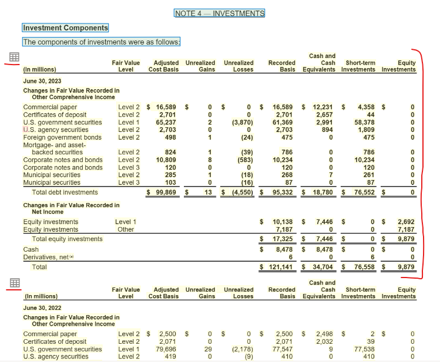
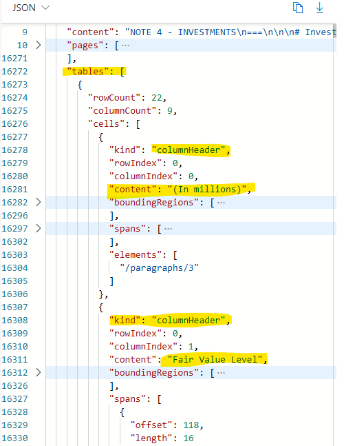

# Experiments

This post outlines a series of experiments conducted to evaluate the performance and accuracy of various strategies in the context of data extraction from tables, images, and graphs.

The following strategies have been employed:

- For Tables:
    - Extraction of raw text data
    - Extraction using markdown formatting
    - Extraction using image-based techniques instead of text

- For Images:
    - Extraction utilizing image analysis with gpt-4o

## Experiment 1: 01-experiment-simpleTable

**Description:** \
This experiment utilized a simple table for analysis. The table, shown below, contains basic information, with a nested table in the Results column. Despite the nested structure, the table is considered to be straightforward.

Two strategies were employed for analysis. The first strategy involved sending the PDF content to Azure Document Intelligence for document reading. The resulting document was then sent to gpt-4o without any post-processing.

The second strategy involved directly feeding the LLM a screenshot of the table. A PNG file was created from the aforementioned table and processed by the code before being sent to the LLM.

**Goal:** \
The objectives of this experiment were to extract the following information:
- Accuracy in the Results Column for Low Vision, ideally obtaining both results in that row.
- Time to complete in the Results column for Low Vision.
- Total number of participants across all disability categories.

**Result:** 
- **Strategy 1 (raw text):** 
    - The overall accuracy and retrieved data were highly accurate across all test cases. The table structure was well understood, allowing for easy summarization of all participants.
- **Strategy 2 (image extraction):** 
    - The overall accuracy and retrieved data were highly accurate across all test cases. The table structure was well understood, allowing for easy summarization of all participants.

The LLM demonstrated the ability to comprehend the structure and content of simple tables. It was capable of extracting information from different rows and columns, as well as summarizing numbers across rows.

**Extra-curriculum:** \
As an additional test, the latest version of gpt-4-turbo was evaluated for its accuracy in reading raw text from tables. The results were highly accurate in terms of the retrieved data. However, the execution time was significantly longer compared to the gpt-4o model.

## Experiment 2: 01-experiment-complexTable

**Description:** 

This experiment utilized a more complex table for analysis. The table, shown below, contains an extraction of Microsofts annual financial report. 

Three strategies were employed for analysis. The first strategy involved sending the PDF content to Azure Document Intelligence for document reading. The resulting document was then sent to gpt-4o without any post-processing.

The second strategy involved directly feeding the LLM a screenshot of the table. A PNG file was created from the aforementioned table and processed by the code before being sent to the LLM.

The last strategy which have been conducted is leveraging Azure Document Intelligence table recognitation and data extraction. Document Intelligence has a build-in functionality to locate tables and store all tables from a document in an array. Each Object represents a table in the entire document.
As you can see from the screenshots, it analyzes each table and provides a JSON file which contains information about the rowCount, columnCount, about the cells, each bounding box of a cell, the boudning regions and much more. 

This result can also be used to feed the LLM with context and information about the structure of a table.

This table is obviously way more complex rather than in *experiment 1* which should highlight the different results for those strategies a lot more. To get accurate results inside this table, the table structure, its dependencies as well the the data need to be understood.

**Goal:**  
The objectives of this experiment were to extract the following information:
- the exact number of recorded basis for equity investments of level 1 in 2023.
- the exact number of recorded basis for equity investments of level 1 in 2022.
- the recorded basis for Corporate notes and bonds of Level 3 in 2023.
- the recorded basis for Corporate notes and bonds of Level 3 in 2022.
- the total number for unrealized gains of total debt investments for 2023 and 2022

**Result:** 
The yellow highlighted numbers in the above printed screenshot, were expected to be retrieved from the picture / document.

- **Strategy 1 (raw text):** 
    - The question about the exact number of recorded basis for equity investments of level 1 in 2023 was answred incorrectly. Instead of the 10.138 it has taken 2.692. 
    - The question about the exact number of recorded basis for equity investments of level 1 in 2022 was answred incorrectly. Instead of the 1.590 it has taken 456.
    - For both questions about the Corporate notes and bonds, the retrieved numbers are correct.
    - The overall numbers as been retrieved correctly.
- **Strategy 2 (image extraction):** 
    - The question about the exact number of recorded basis for equity investments of level 1 in 2023 was answered correctly.
    - The question about the exact number of recorded basis for equity investments of level 1 in 2022 was answered correctly.
    - Nevertheless, both other questions about Corporate notes and bonds were sometimes answered correctly, somtimes it did respond with 0 (which is the item next to the desired one)
    - The overall numbers as been retrieved correctly.
- **Strategy 3 (di table detection):** 
    - all questions were answered correctly!

For the more complex tables, di table detection and data extraction should be used. From all three strategies, the di table extraction performs very precise.

## Experiment 3: [Title]

**Description:** [Description of the experiment]

**Goal:** [Objective or purpose of the experiment]

**Result:** [Summary of the experiment's outcome]
