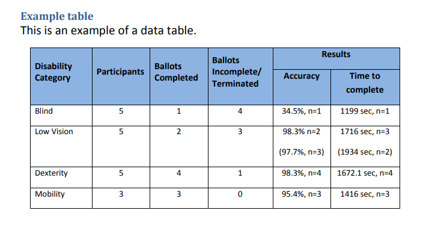
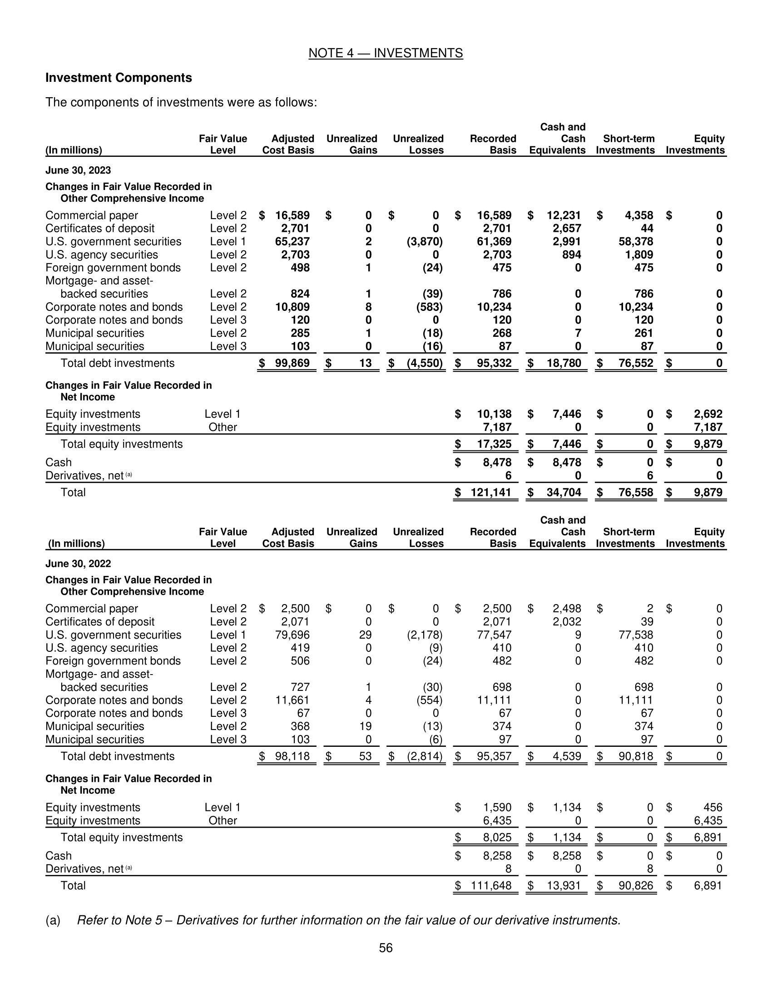
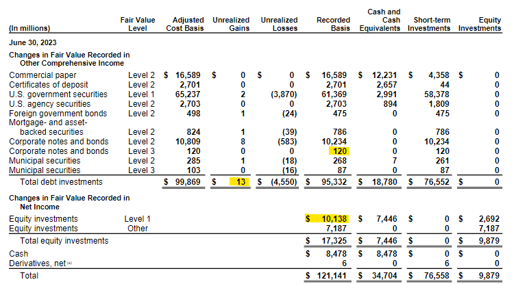
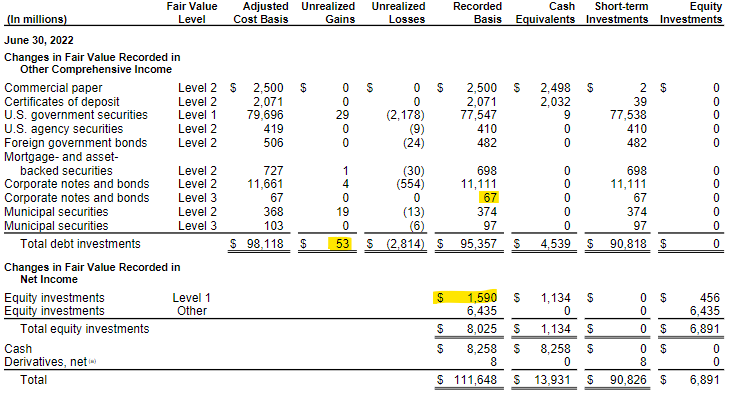
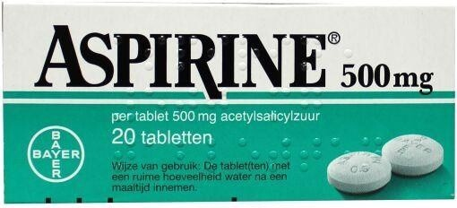
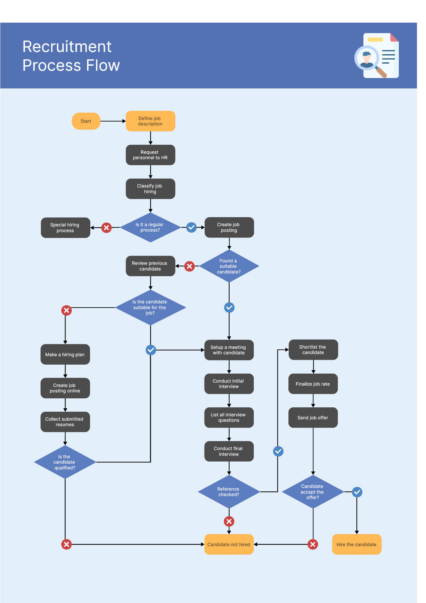
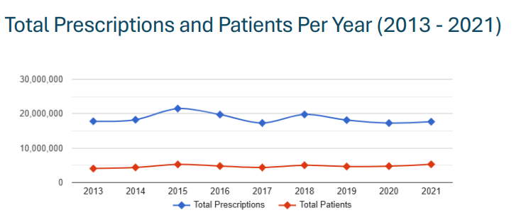
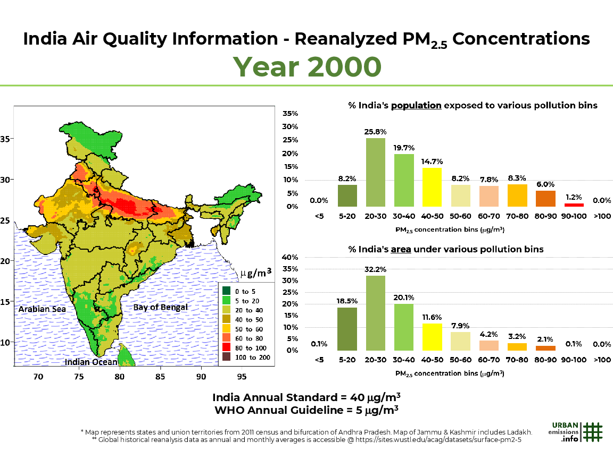
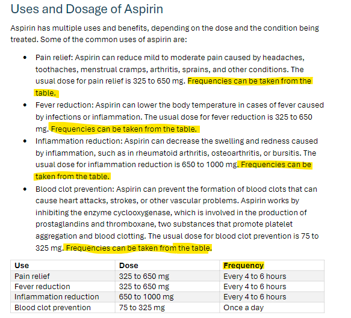
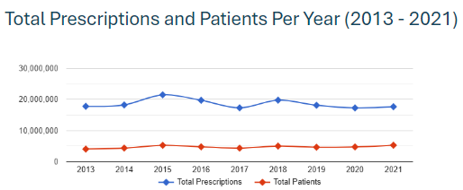

# Data experiments from tables, images and graphs

## Overview
This post provides an overview of a series of experiments conducted to evaluate the performance and accuracy of different strategies for data extraction from tables, images, and graphs. The experiments aimed to assess the effectiveness of various techniques in extracting information from different types of data.

For tables, three strategies were employed: extracting raw text data, using markdown formatting for extraction, and utilizing image-based techniques instead of text. The goal was to compare the accuracy and efficiency of these strategies in extracting data from tables.

For images, the experiment focused on utilizing image analysis with gpt-4o for extraction. The objective was to evaluate the effectiveness of this technique in generating accurate descriptions of images and compare it to human interpretation.

The experiments were designed to provide insights into the performance and suitability of different strategies for data extraction in various scenarios. The results obtained from these experiments can help inform the selection of appropriate techniques for specific data extraction tasks.

### Experiment 1: 01-experiment-simpleTable

**Description:** \
This experiment utilized a simple table for analysis. The table, shown below, contains basic information, with a nested table in the Results column. Despite the nested structure, the table is considered to be straightforward.



Two strategies were employed for analysis. The first strategy involved sending the PDF content to Azure Document Intelligence for document reading. The resulting document was then sent to gpt-4o without any post-processing.

The second strategy involved directly feeding the LLM a screenshot of the table. A PNG file was created from the aforementioned table and processed by the code before being sent to the LLM.

**Goal:** \
The objectives of this experiment were to extract the following information:
- Accuracy in the Results Column for Low Vision, ideally obtaining both results in that row.
- Time to complete in the Results column for Low Vision.
- Total number of participants across all disability categories.

**Result:** 
- **Strategy 1 (raw text):** 
    - The overall accuracy and retrieved data were highly accurate across all test cases. The table structure was well understood, allowing for easy summarization of all participants.
- **Strategy 2 (image extraction):** 
    - The overall accuracy and retrieved data were highly accurate across all test cases. The table structure was well understood, allowing for easy summarization of all participants.

The LLM demonstrated the ability to comprehend the structure and content of simple tables. It was capable of extracting information from different rows and columns, as well as summarizing numbers across rows.

**Extra-curriculum:** \
As an additional test, the latest version of gpt-4-turbo was evaluated for its accuracy in reading raw text from tables. The results were highly accurate in terms of the retrieved data. However, the execution time was significantly longer compared to the gpt-4o model.

### Experiment 2: 02-experiment-complexTable

**Description:** 

This experiment involved the analysis of a more complex table. The table, displayed below, contains the extracted data from Microsoft's annual financial report. 



Three strategies were employed for analysis. The first strategy involved sending the PDF content to Azure Document Intelligence for document reading. The resulting document was then sent to gpt-4o without any post-processing.

The second strategy involved directly feeding the LLM a screenshot of the table. A PNG file was created from the aforementioned table and processed by the code before being sent to the LLM.

The final strategy utilized Azure Document Intelligence's table recognition and data extraction capabilities. Document Intelligence has a built-in functionality to locate tables and store them in an array. Each object represents a table in the document and provides information such as the row count, column count, cell details, bounding boxes, and more. This information can be used to provide context and structure to the LLM.

This table is significantly more complex than the one in *Experiment 1*, highlighting the differences in results obtained from the strategies. To accurately extract information from this table, understanding its structure, dependencies, and data is crucial.


**Goal:**  
The objectives of this experiment were to extract the following information:
- The exact number of recorded basis for equity investments of level 1 in 2023.
- The exact number of recorded basis for equity investments of level 1 in 2022.
- The recorded basis for Corporate notes and bonds of Level 3 in 2023.
- The recorded basis for Corporate notes and bonds of Level 3 in 2022.
- The total number of unrealized gains of total debt investments for 2023 and 2022.

**Result:** 
The highlighted numbers in the provided screenshot were expected to be retrieved from the image/document.




- **Strategy 1 (raw text):** 
    - The question regarding the exact number of recorded basis for equity investments of level 1 in 2023 was answered incorrectly. Instead of 10.138, it retrieved 2.692. 
    - The question regarding the exact number of recorded basis for equity investments of level 1 in 2022 was answered incorrectly. Instead of 1.590, it retrieved 456.
    - Both questions about the recorded basis for Corporate notes and bonds were answered correctly.
    - The overall numbers were retrieved correctly.
- **Strategy 2 (image extraction):** 
    - The question regarding the exact number of recorded basis for equity investments of level 1 in 2023 was answered correctly.
    - The question regarding the exact number of recorded basis for equity investments of level 1 in 2022 was answered correctly.
    - However, both questions about Corporate notes and bonds were sometimes answered correctly and sometimes returned 0 (which is the value next to the desired one).
    - The overall numbers were retrieved correctly.
- **Strategy 3 (di table detection):** 
    - All questions were answered correctly!

For more complex tables, utilizing di table detection and data extraction is recommended. Among the three strategies, di table extraction demonstrates high precision.

### Experiment 3: 03-experiment-imageDescriptions

**Description:**  
This experiment was specifically designed to explore the extraction of information from images. The main objective of this experiment was to replace images in documents with descriptive text, thereby enabling semantic searching of images. Throughout the experiment, a variety of image types were tested, including basic illustrations, flowcharts, and architectural images. The purpose of this testing was to evaluate the effectiveness of different techniques in accurately extracting information from these images. 




**Goal:**  
The goal was to assess the accuracy of image descriptions generated by gpt-4o in comparison to human interpretation of each image.

**Result:**  
The generation of image descriptions using gpt-4o proved to be highly effective. The process was efficient, and the descriptions provided were precise and informative. The example of the rag pattern demonstrated the LLM's ability to interpret the image in the correct sequence, even without explicit step numbering.

### Experiment 4: 04-experiment-graphDataExtraction
**Description:**  
This experiment focused on extracting information from graphs, with the primary objective of replacing graphs in documents with descriptive text. The aim was to enable semantic searching of graphs and improve accessibility.
I have tested more basic graphs as well as more advanced graphs.



**Goal:**  
The goal of this experiment was to evaluate the accuracy of graph descriptions generated by gpt-4o, comparing them to human interpretation. The objective was to assess the effectiveness of gpt-4o in accurately describing graphs and providing meaningful information.

**Result:**  
The results of this experiment demonstrated that gpt-4o was highly effective in generating accurate and informative descriptions of graphs. It was able to interpret both basic and complex graphs with precision. Additionally, tests were conducted to evaluate the usability of the generated descriptions for answering follow-up questions. The descriptions were saved as text and provided to another gpt-4o call, which successfully answered the follow-up questions based on the retrieved descriptions. This indicates the potential for using gpt-4o-generated graph descriptions for further analysis and decision-making processes. I have observed that the resolution of images and graphs significantly impacts the quality of the generated answers.

### Experiment 5: 05-experiment-finalSolution
**Description:**  
This experiment presents a potential solution for extracting data from tables, images, and graphs, and utilizing that information in conjunction with the extracted content of a document to provide answers to user queries.

The solution entails a comprehensive workflow that encompasses multiple stages.

During the "Ingestion" phase, the system accepts a PDF file as input and leverages Azure Document Intelligence to analyze the document and extract pertinent information. The document is then divided by page, with page numbers retained for reference. Objects such as figures (graphs or images) and tables are identified, and screenshots are generated for images found on the pages. Object identifiers are generated and appended as metadata to the segmented document. Additionally, indexes are created for both the document objects and the document content, with references to the objects. This includes embedding for images and graphs as well.

In the "Retrieval" phase, when a user poses a query, the system generates an embedding (omitted in this context) and searches the AI Search Document Content Index. The system then presents the object identifiers associated with the query and retrieves the corresponding items from the document Object index. For tables, the JSON object representing the table is directly included in the system message. Figures were "described" during the index ingestion phase, so the description is also incorporated into the system message. This approach provides a systematic and efficient means of extracting and utilizing information from various document elements, enabling accurate and context-aware responses to user queries.

**Goal:**  
The goal was forcing the llm for creation of an answer based on data which need to be extracted from the document content, tables as well as images.

```python
prompt = "Summarize the Uses and Dosage of Aspirin and list the frequency of intake. Also describe the Total Prescriptions and Patients Per Year."
```

As you can see from the query, we want to retrieve the following parts from the sample document.




**Result:** 

As you can see from the result below, the LLM could leverage all sources to provide a sensfull answer.

```markdown
"### Uses and Dosage of Aspirin:\n\nAspirin is commonly used for:\n\n1. **Pain Relief**:\n   - **Dose**: 325 to 650 mg\n   - **Frequency**: Every 4 to 6 hours\n\n2. **Fever Reduction**:\n   - **Dose**: 325 to 650 mg\n   - **Frequency**: Every 4 to 6 hours\n\n3. **Inflammation Reduction**:\n   - **Dose**: 650 to 1000 mg\n   - **Frequency**: Every 4 to 6 hours\n\n4. **Blood Clot Prevention**:\n   - **Dose**: 75 to 325 mg\n   - **Frequency**: Once a day\n\n### Total Prescriptions and Patients Per Year (2013 - 2021):\n\n- **Total Prescriptions**:\n  - **Range**: Approximately 20,000,000 to 25,000,000 per year.\n  - **Trend**: Slight increase observed between 2015-2017, but overall relatively stable with minor fluctuations.\n  \n- **Total Patients**:\n  - **Range**: Approximately 8,000,000 to 10,000,000 per year.\n  - **Trend**: Fairly consistent without significant increases or decreases throughout the years.\n\nAspirin remains one of the world's most researched and widely prescribed drugs, with billions of tablets consumed globally each year.\n\n**Note**: These figures provide an overview of aspirin use and trends in prescriptions and patient numbers over nearly a decade."
```

Even by asking a more precise question about the graph, it will use the llm to interpret this graph every time rather than falling back to a previously generated description which might not contain the required information.

```python
prompt = "Summarize the Uses and Dosage of Aspirin and list the frequency of intake. How many Prescriptions were given in 2015."
```
following answer:

```markdown
'### Uses and Dosage of Aspirin\n\nAspirin is commonly used for several conditions, with specific dosages and frequencies depending on the intended use:\n\n1. **Pain Relief**\n    - **Dose**: 325 to 650 mg\n    - **Frequency**: Every 4 to 6 hours\n\n2. **Fever Reduction**\n    - **Dose**: 325 to 650 mg\n    - **Frequency**: Every 4 to 6 hours\n\n3. **Inflammation Reduction**\n    - **Dose**: 650 to 1000 mg\n    - **Frequency**: Every 4 to 6 hours\n\n4. **Blood Clot Prevention**\n    - **Dose**: 75 to 325 mg\n    - **Frequency**: Once a day\n\n### Frequency of Intake\n\nFor pain relief, fever reduction, and inflammation reduction, aspirin is typically taken every 4 to 6 hours. For blood clot prevention, it is taken once a day.\n\n### Prescription Data for 2015\n\nApproximately 24,000,000 prescriptions for aspirin were given in 2015.'
```
## Summary

The key takeaways from the experiments on data extraction from tables, images, and graphs are highly positive. Data extraction is notably accurate for basic tables, images, and graphs. Even for simple nested tables, raw text extraction without post-processing can be effective.

Azure Document Intelligence emerges as the preferred solution for extracting data from more complex and nested tables. It excels in identifying tables within a document and comprehending their intricate structures, laying the groundwork for precise and accurate answers.

Data extraction from images and graphs also performs well, as anticipated. However, it is important to note that the quality of results, particularly from graphs, is highly dependent on the resolution of the input image. Higher resolution images yield better results. For instance, while interpreting a bar graph without explicit labels, the language model must deduce the information independently.

### Solution to ingest images and graphs

There are multiple approaches to this topic, each with its own pros and cons. Ultimately, the decision should be based on whether user questions extend beyond a static extraction of embedded image or graph descriptions. 

If there is a need for text generation where users continuously ask the LLM very specific questions based on those images related to the users question, the LLM must be leveraged each time to extract the necessary information from the image. 

Conversely, if this is not the case, a one-time, very detailed static description of the image may suffice to serve the user. This approach would reduce the time required for answer generation, as fewer LLM requests would be needed. However, the drawback is that the image is interpreted only once.